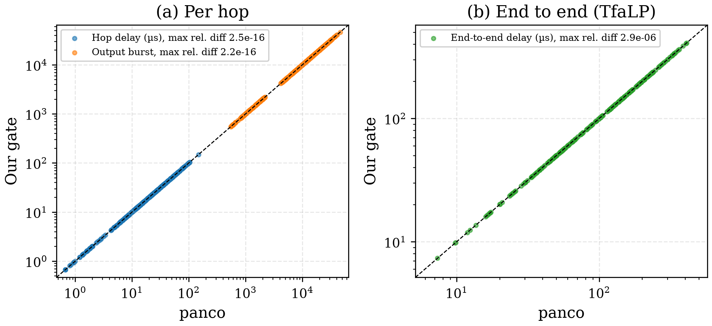
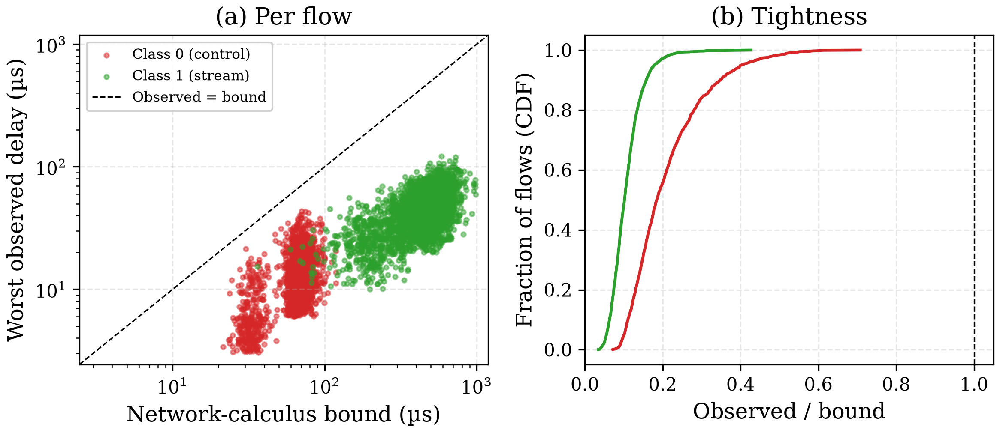
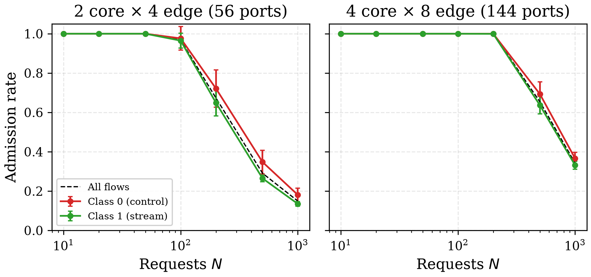
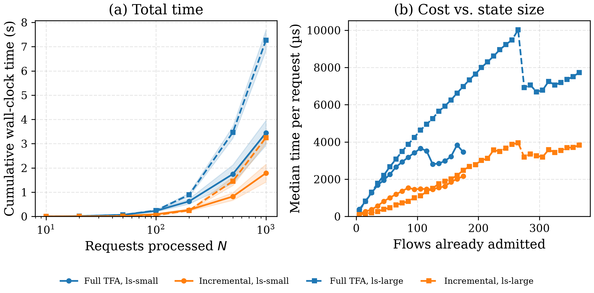

# Certified Admission Control for TSN

Preparatory work for the PhD *"Certified Dynamic Reconfiguration of Time-Sensitive Networks: Online Admission Control under Worst-Case Determinism Guarantees"* (LyRIDS, ECE × CEDRIC, Cnam) in the [thesis theme](docs/projects/thesis%20theme.pdf).

## Overview

TSN guarantees worst-case latency only for a configuration fixed and verified offline. Online reconfiguration can be proposed quickly by heuristics, ILP/SMT or DRL/GNN, but none of these certifies worst-case delays. We place a **certified admission gate** between any proposer and the network: a flow is committed only with a machine-checkable certificate that every admitted flow still meets its deadline. The guarantee holds as far as the network model does.

## Repository structure

```
├── src/
│   ├── tsn_gate/        # model, NP-SP analysis, full/incremental gates, certificate checker, simulator
│   ├── tests/           # hand calculation, full = incremental, tampered certificates, simulation
│   ├── validation/      # cross-check against panco
│   ├── experiments/     # benchmark_gate.py, plot_figures.py
│   ├── results/         # raw CSVs
│   └── figures/         # PNG/PDF
└── docs/
    ├── articles/        # mini article: tsn-admission-gate.tex/.pdf (IEEEtran), architecture figure, BibTeX
    ├── presentation/    # Beamer slides: main.tex/.pdf, figures, BibTeX
    ├── projects/        # thesis offer, prior PPO project
    ├── courses/         # AI introduction, deep learning
    └── math/            # linear algebra, probability
```

## Model

1 Gbit/s switches in a two-tier TSN topology (edge switches linked to every core switch), fixed shortest-path routing with ECMP tie-breaking, token-bucket flows $(b, r)$, non-preemptive static priority (NP-SP), deterministic network calculus (Total Flow Analysis). For class $k$ at a port of rate $C$:

$$
d_k = \frac{B_H + L_{lo} + B_k}{C - R_H} + t_{proc}, \qquad R_H + R_k \le C
$$

$$
b' = b + r \, d_k, \qquad D = \sum_{h \in \mathcal{P}} d_k^{(h)}
$$

$B_H, R_H$: aggregate burst and rate of higher-priority flows; $L_{lo}$: largest lower-priority frame (non-preemptive blocking); $B_k, R_k$: aggregates of class $k$; $b'$: output burst; $D$: end-to-end bound over path $\mathcal{P}$.

## Results

Requests are submitted by a greedy proposer: seeded random requests in arrival order, each kept if the gate accepts it, never revisited. On two two-tier TSN networks (small: 2 core × 4 edge switches, 56 ports; large: 4 core × 8 edge switches, 144 ports; 5 end stations per edge switch, ECMP routing), each fed 1,000 seeded flow requests over 10 seeds, the gate's bounds match the reference tool panco [5] to a relative difference of $2.5 \times 10^{-16}$ per hop (1,119 values) and $2.9 \times 10^{-6}$ end to end (242 values; the residual comes from lp_solve printing 6 significant digits) (Fig. 1). In packet-level simulation, none of the 4,915 admitted flows exceeded its bound; the worst observed delay is a median of 19 % of the bound for control traffic and 10 % for stream traffic, a sanity check rather than a tightness measure, since the simulator does not force the worst case (Fig. 2). The small network accepts every request up to 50 and the large one up to 200; they then saturate at 150 ± 14 and 342 ± 22 admitted flows out of 1,000, with control traffic accepted slightly more often (Fig. 3). The incremental gate gives the same verdicts and bit-identical bounds as the full TFA while being 1.97× (small) and 2.24× (large) faster, with a median admission time of 1.6 ms and 3.3 ms (Fig. 4; single-threaded Python, timings are machine-dependent).

| | |
|:---:|:---:|
|  |  |
| **Fig. 1.** Our bounds vs. panco, per hop & end to end. | **Fig. 2.** Simulated worst delay vs. bound (4,915 flows). |
|  |  |
| **Fig. 3.** Admission rate of first $N$ requests, per class. | **Fig. 4.** Full vs. incremental gate: total time, cost/request. |

## Reproduction

All workloads and simulations are seeded, so verdicts, bounds and simulated delays are reproduced exactly; only the timing columns depend on the machine. 

```bash
cd src
pip install -r requirements.txt
python -m pytest -q                        
python experiments/benchmark_gate.py       
python experiments/plot_figures.py        
```

## References

1. J.-Y. Le Boudec, P. Thiran, *Network Calculus*, LNCS 2050, Springer, 2001.
2. L. Zhao, P. Pop, Z. Zheng, Q. Li, "Timing Analysis of AVB Traffic in TSN Networks Using Network Calculus," RTAS 2018. [PDF](https://www2.compute.dtu.dk/~paupo/publications/Zhao2017aa-Timing%20Analysis%20of%20AVB%20Traffic-.pdf)
3. M. Alshiekh et al., "Safe Reinforcement Learning via Shielding," AAAI 2018.
4. S. Bondorf, J. B. Schmitt, "The DiscoDNC v2: A Comprehensive Tool for Deterministic Network Calculus," VALUETOOLS 2014. [NetCal/DNC](https://github.com/NetCal/DNC)
5. A. Bouillard, *panco: Performance Analysis with Network Calculus and Optimization*, 2022. [anne-bou/panco](https://github.com/anne-bou/panco); theory in A. Bouillard, M. Boyer, E. Le Corronc, *Deterministic Network Calculus*, Wiley-ISTE, 2018.
6. C. Xue et al., "Real-Time Scheduling for 802.1Qbv Time-Sensitive Networking (TSN): A Systematic Review and Experimental Study," RTAS 2024. [ChuanyuXue/tsnkit](https://github.com/ChuanyuXue/tsnkit)
